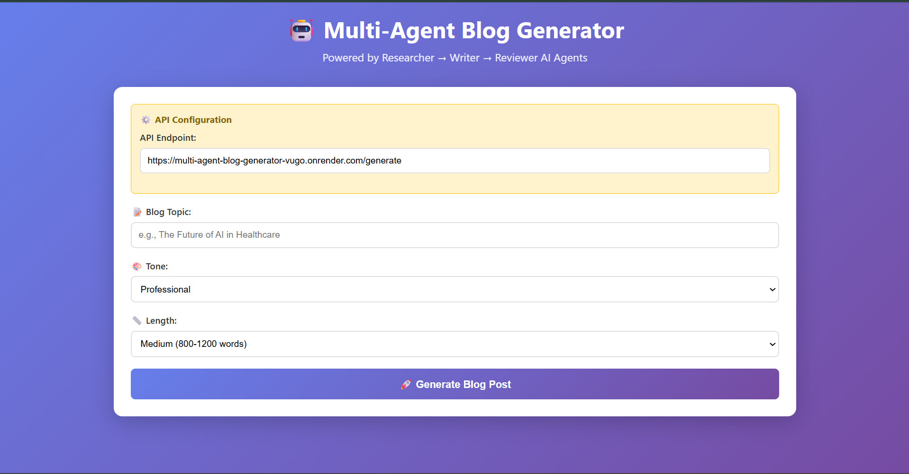

# 🤖 Multi-Agent Blog Generator

A beautiful, single-page **AI-powered blog generation tool** that connects to a backend API powered by multiple AI agents — **Researcher → Writer → Reviewer** — to generate high-quality blog posts based on your topic, tone, and desired length.

## 🚀 Features

- 🧠 **Multi-Agent Workflow**: Automatically coordinates AI agents for research, drafting, and reviewing.
- 🎨 **Responsive UI**: Clean, modern design built using HTML, CSS, and vanilla JavaScript.
- ⚙️ **Dynamic API Detection**: Automatically switches between local and production API endpoints.
- 📄 **Tabbed Results View**: View Research, Draft, and Final Blog outputs in separate tabs.
- ☁️ **Deploy-Ready**: Preconfigured for **Vercel** static hosting.

---

## 🔗 Backend Repository

You can find the backend implementation here:  
👉 [AI Blog Generator Backend](https://github.com/kartikmahajan5688/multi-agent-blog-generator)

---

## 🏗️ Project Structure

```
📂 multi-agent-blog-generator/
│
├── index.html       # Main frontend (HTML, CSS, and JS)
├── vercel.json      # Deployment config for Vercel
└── README.md        # Project documentation
```

---

## 💡 How It Works

1. **User Input**
   Enter your blog topic, select tone and length, and hit “Generate”.

2. **Backend Call**
   The frontend sends a POST request to the API endpoint:

   ```
   POST /generate
   {
     "topic": "The Future of AI in Healthcare",
     "tone": "professional",
     "length": "medium"
   }
   ```

3. **AI Pipeline (Backend)**

   - 🧩 **Researcher Agent** gathers contextual info & outline.
   - ✍️ **Writer Agent** creates the initial draft.
   - 🧑‍💻 **Reviewer Agent** refines and polishes the final blog.

4. **Frontend Display**
   The app displays three sections:

   - 🔍 Research & Outline
   - ✍️ Draft
   - 🎯 Final Blog Post

---

## ⚙️ API Configuration

By default, the frontend auto-detects environment and uses the appropriate API:

```js
const PROD_API_BASE =
  "https://multi-agent-blog-generator-vugo.onrender.com/generate";
const LOCAL_API_BASE = "http://localhost:8000/generate";
```

You can manually override it in the **API Configuration** section at the top of the page.

---

## 🧩 Backend (Optional Setup)

You need a running backend server that provides the `/generate` API route.

Example (FastAPI, Flask, or Node.js):

```python
@app.post("/generate")
def generate_blog(data: BlogRequest):
    # return {
    #   "research": "...",
    #   "draft": "...",
    #   "final_blog": "..."
    # }
```

---

## 🧑‍💻 Running Locally

1. Clone the repository:

   ```bash
   git clone https://github.com/kartikmahajan5688/ai-blog-generator-frontend.git
   cd ai-blog-generator-frontend
   ```

2. Start your backend API (e.g., Flask/FastAPI/Node server).

3. Open the frontend:

   ```bash
   open index.html
   ```

   or just double-click `index.html` in your file explorer.

---

## 🌐 Deployment (Vercel)

Already configured for **Vercel static hosting** via `vercel.json`.

To deploy:

```bash
npm i -g vercel
vercel
```

---

## 🖼️ Preview



---

## 📜 License

This project is licensed under the **MIT License** — feel free to modify and use it.

---

## 💬 Credits

Built with ❤️ by **Kartik Mahajan**
Powered by AI Agents: _Researcher → Writer → Reviewer_
